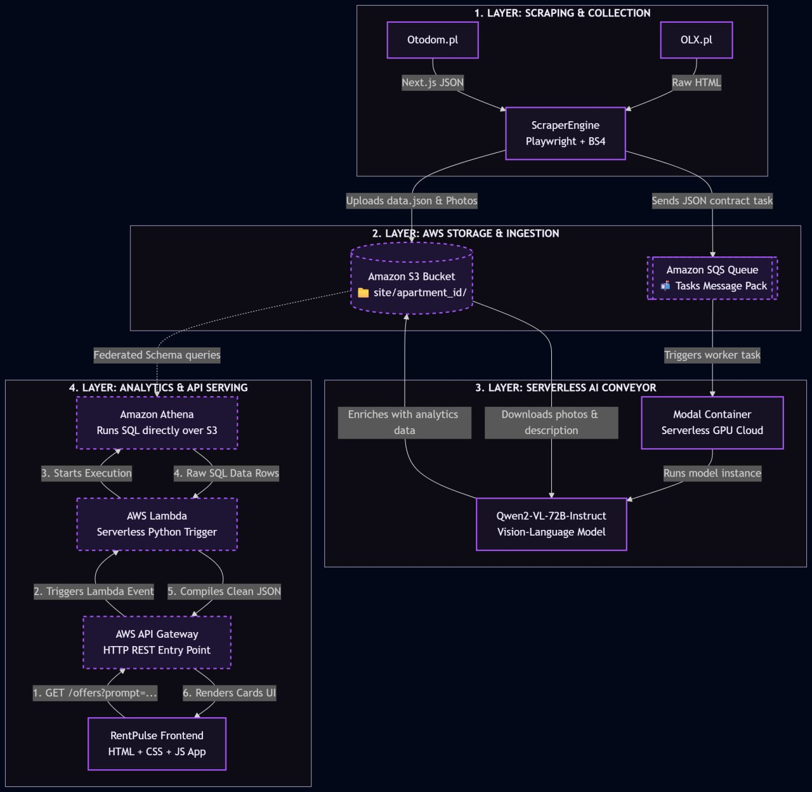

# RentPulse: Advanced Real Estate Scraper & Cloud Pipeline 🏠🔍

RentPulse is a high-performance, asynchronous real estate web scraper built with Python, Playwright, and BeautifulSoup4. It is specifically designed to crawl and cleanly extract rental housing listings from OLX.pl and Otodom.pl dynamically.

The project features a cloud-native serverless architecture designed to move textual fields and visual assets automatically into an AWS Storage Pipeline (S3 and SQS Broker), preparing datasets for advanced serverless AI layout verification via Modal Cloud and Qwen2-VL-72B-Instruct.

---

## ✨ Key Features

- Asynchronous Execution Architecture: Powered by asyncio and Playwright to handle high-speed browser automation, concurrent page streams, and event loop cycles efficiently.
- Hydration State Extraction: The OTODOMParser module bypasses slow runtime DOM queries by targeting the hidden React/Next.js script node __NEXT_DATA__ directly. This ensures 100% accurate data retrieval and high resistance against user interface structural updates.
- Smart Boundary Pagination:
  - OLX: Monitors search limits dynamically, detecting the boundary of active results using "0 listings found" conditional blocks.
  - Otodom: Interrogates target DOM pagination controllers natively by analyzing the current state and disabled property tags of the pagination button elements.
- Deep Metadata Mining: Automatically parses chronological parameters (creation date versus last bump/push-up adjustments), detailed technical feature tables (area, floor bounds, rent charges, deposits), and raw image link sets.
- Automated Processing Pipeline: Instantly splits raw records, converting attributes into clean dictionary formats while feeding structural images and transactional tracking files forward to Amazon Web Services pipelines.

---

## 🛠 Tech Stack

- Core Programming Language: Python 3.10+
- Web Automation: Playwright Async API
- HTML Document Traversal: BeautifulSoup4
- Data Structuring & Utilities: Pandas, JSON Deserializers, Regular Expressions (Regex)
- Cloud Infrastructure Integrations: AWS S3, AWS SQS, AWS API Gateway, AWS Lambda, Amazon Athena
- AI Execution Layer: Modal Serverless Cloud Architecture, Qwen2-VL-72B-Instruct Vision-Language Model

---

## 💎 System Architecture & Data Pipeline

The backend leverages a completely serverless, event-driven data flow designed to run efficiently at any scale without maintaining expensive dedicated machines:



---

## 🚀 Quick Start

Follow these steps to set up and run the RentPulse ingestion engine locally on your machine:

### 1. Prerequisites & Environment Setup
Make sure you have Python 3.10 or higher installed. This project manages isolated scopes using standard Python virtual environments or Conda.

1. Install Project Dependencies
Install the required parsing libraries and initialize the isolated Chromium headless binaries managed by Playwright:

```bash
pip install playwright beautifulsoup4 pandas httpx boto3 python-dotenv
playwright install chromium

2. Configure Infrastructure Tokens & Target Stores
Create a production runtime environment configuration file named .env in the root folder directory path:

```bash
aws_access_key_id=YOUR_AWS_ACCESS_KEY
aws_secret_access_key=YOUR_AWS_SECRET_KEY
aws_session_token=YOUR_AWS_SESSION_TOKEN
sqs_queue_url=YOUR_AWS_SQS_QUEUE_URL